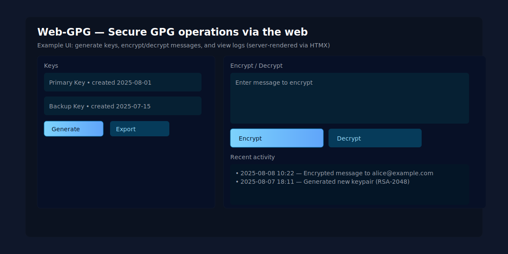

# Web-GPG

A minimal web app for encrypting and decrypting text with PGP keys.



Quick run


Database

- By default the app uses a local SQLite file (`data.db`).
- To use Postgres, set `DATABASE_URL` to your Postgres connection string (the app will use the `pgx` driver when `DATABASE_URL` is present).
- Run the published image (recommended):

  ```bash
  docker run --rm -p 8080:8080 lkshrk/gpg-web:latest
  ```

- Or run locally:

  ```bash
  go run .
  ```

Usage (brief)

- Add a key: give it a name, paste an ASCII-armored public or private key, optionally provide the passphrase (stored encrypted if `MASTER_KEY` is set).
- Encrypt: choose a public key, paste plaintext, click Encrypt to get an armored message.
- Decrypt: choose a private key (with unlocked or stored passphrase), paste armored message, click Decrypt to recover plaintext.

Security

- Keys and any stored passphrases are stored in the local SQLite DB. Do not add private keys or passphrases to public/shared deployments unless you understand and mitigate the risks.

Build / Develop

- Build: `go build ./cmd/gpgweb && ./gpgweb`
- Tests: `go test ./...`
- Formatting: `gofmt -w .`

Contact / Contribute

- Open issues and PRs against `main`.
