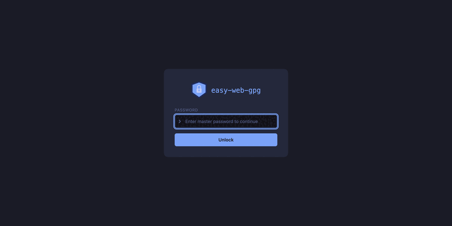

# Easy Web GPG

<div align="center">
  
</div>

Lightweight web UI for encrypting/decrypting PGP messages.

## Features

- Minimal Tailwind-styled web interface
- Master-password protected access (24h sessions)
- AES-encrypted passphrase storage

## Quick Start

```bash
export MASTER_PASSWORD='your-secret-password'
make run
```

Open http://localhost:8080

## Configuration

| Variable | Required | Description |
|---|:---:|---|
| `MASTER_PASSWORD` | yes | Master password for deriving encryption keys (Argon2id) |
| `DATABASE_URL` | no | Database connection (defaults to SQLite) |
| `PORT` | no | HTTP port (default: `8080`) |
| `FORCE_SECURE_COOKIES` | no | Set to `1` for HTTPS environments |

## Development

### Live Reload (Recommended)

```bash
export MASTER_PASSWORD=test123
make dev
```

This starts a development environment with:
- **Automatic Go rebuild** on code changes
- **Live CSS recompilation** with Tailwind
- **Template hot reload**

See [DEVELOPMENT.md](DEVELOPMENT.md) for detailed development guide.

### Other Commands

```bash
# Run tests
make test

# Run visual regression tests
make test-visual

# Build binary
make build

# Use devcontainer for full dev environment
# (includes Go, Tailwind CLI, all tools)
```

See [docs/OPTIMIZATION.md](docs/OPTIMIZATION.md) for architecture details and CI/CD pipeline information.

## Security

⚠️ **Important:**
- Keep `MASTER_PASSWORD` secret and use a secrets manager in production
- Run behind HTTPS with `FORCE_SECURE_COOKIES=1`
- Back up your database to preserve the encryption salt

## Contributing

Contributions welcome. Open an issue or PR with proposed changes.

## License

See repository for license details.
